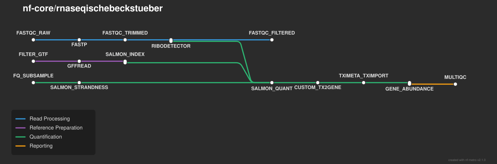

<h1>
  <picture>
    <source media="(prefers-color-scheme: dark)" srcset="docs/images/nf-core-rnaseqischebeckstueber_logo_dark.png">
    
  </picture>
</h1>

[](https://github.com/codespaces/new/nf-core/rnaseqischebeckstueber)
[](https://github.com/nf-core/rnaseqischebeckstueber/actions/workflows/nf-test.yml)
[](https://github.com/nf-core/rnaseqischebeckstueber/actions/workflows/linting.yml)
[](https://nf-co.re/rnaseqischebeckstueber/results)
[](https://doi.org/10.5281/zenodo.XXXXXXX)
[](https://www.nf-test.com)

[](https://www.nextflow.io/)
[](https://github.com/nf-core/tools/releases/tag/4.1.0)
[](https://docs.conda.io/en/latest/)
[](https://www.docker.com/)
[](https://sylabs.io/docs/)
[](https://cloud.seqera.io/launch?pipeline=https://github.com/nf-core/rnaseqischebeckstueber)

[](https://nfcore.slack.com/channels/rnaseqischebeckstueber)
[](https://bsky.app/profile/nf-co.re)
[](https://mstdn.science/@nf_core)
[](https://www.youtube.com/c/nf-core)

## Introduction

**nf-core/rnaseqischebeckstueber** is a bioinformatics pipeline for processing single-end and paired-end RNA-seq FASTQ reads using Nextflow and the nf-core framework. It performs read quality control, adapter and quality trimming, ribosomal RNA removal, reference preparation, and transcript quantification with Salmon, followed by gene-level summarization using tximport/tximeta. The pipeline produces quality-control reports, transcript- and gene-level expression matrices, and a MultiQC report that includes the 20 genes with the highest mean TPM across samples.



1. Read QC ([`FastQC`](https://www.bioinformatics.babraham.ac.uk/projects/fastqc/)) on raw reads.
2. Trim adapters and low-quality bases ([`fastp`](https://github.com/OpenGene/fastp)).
3. Check trimmed reads ([`FastQC`](https://www.bioinformatics.babraham.ac.uk/projects/fastqc/)).
4. Estimate library strandedness using [`Salmon`](https://salmon.readthedocs.io/) on a read subset.
5. Identify and remove rRNA reads ([`RiboDetector`](https://github.com/hzi-bifo/RiboDetector)).
6. Check rRNA-filtered reads ([`FastQC`](https://www.bioinformatics.babraham.ac.uk/projects/fastqc/)).
7. Prepare the reference: filter GTF annotations, extract transcript sequences ([`GFFREAD`](https://github.com/gpertea/gffread)), and build a Salmon index.
8. Quantify transcript abundances ([`Salmon`](https://salmon.readthedocs.io/)).
9. Generate transcript- and gene-level expression matrices ([`tximport`](https://bioconductor.org/packages/tximport/) / [`tximeta`](https://bioconductor.org/packages/tximeta/)).
10. Identify the 20 genes with the highest mean TPM across samples (`GENE_ABUNDANCE`).
11. Present QC, analysis summaries, parameters, software versions, and the gene abundance table ([`MultiQC`](http://multiqc.info/)).

## Usage

> [!NOTE]
> If you are new to Nextflow and nf-core, please refer to [this page](https://nf-co.re/docs/get_started/environment_setup/overview) on how to set-up Nextflow. Make sure to [test your setup](https://nf-co.re/docs/get_started/run-your-first-pipeline) with `-profile test` before running the workflow on actual data.

First, prepare a samplesheet with your input data. It must contain sample identifiers and paths to gzip-compressed FASTQ files.

`samplesheet.csv` (paired-end example):

```csv
sample,fastq_1,fastq_2
sample1,data/sample1_R1.fastq.gz,data/sample1_R2.fastq.gz
sample2,data/sample2_R1.fastq.gz,data/sample2_R2.fastq.gz
```

For single-end data, `fastq_2` can be omitted:

```csv
sample,fastq_1
sample1,data/sample1.fastq.gz
sample2,data/sample2.fastq.gz
```

Each row represents a FASTQ file (single-end) or a pair of FASTQ files (paired-end). The `sample` column contains a sample identifier without spaces, `fastq_1` is the required path to the first read file, and `fastq_2` is the optional path to the second read file. FASTQ files must be gzip-compressed (`.fastq.gz` or `.fq.gz`), and all paths must exist.

The pipeline also requires a reference genome FASTA and matching GTF annotation, supplied using `--fasta` and `--gtf`. Alternatively, a configured iGenomes reference can be selected using `--genome` (for example, `GRCh38`); this configuration is not used when `--igenomes_ignore` is enabled.

Now, you can run the pipeline using:

```bash
nextflow run nf-core/rnaseqischebeckstueber \
  -profile docker \
  --input samplesheet.csv \
  --fasta reference.fa \
  --gtf annotation.gtf \
  --outdir results
```

For a locally cloned, unpublished development version, run `nextflow run .` from the repository directory instead of `nextflow run nf-core/rnaseqischebeckstueber`.

To resume an interrupted or previously executed run, add `-resume` to the command. Nextflow reuses cached completed processes when their relevant inputs and execution settings have not changed and the cache remains available.

> [!WARNING]
> Please provide pipeline parameters via the CLI or Nextflow `-params-file` option. Custom config files including those provided by the `-c` Nextflow option can be used to provide any configuration _**except for parameters**_; see [docs](https://nf-co.re/docs/running/run-pipelines#using-parameter-files).

For more details and further functionality, please refer to the [usage documentation](https://nf-co.re/rnaseqischebeckstueber/usage) and the [parameter documentation](https://nf-co.re/rnaseqischebeckstueber/parameters).

## Pipeline output

To see the results of an example test run with a full size dataset refer to the [results](https://nf-co.re/rnaseqischebeckstueber/results) tab on the nf-core website pipeline page.
For more details about the output files and reports, please refer to the
[output documentation](https://nf-co.re/rnaseqischebeckstueber/output).

The pipeline publishes its results to the directory specified by `--outdir`. The main outputs are:

- **Read QC and preprocessing:** FastQC reports for raw, trimmed, and rRNA-filtered reads; fastp-trimmed reads and statistics; RiboDetector-filtered reads; and strandedness estimates.
- **Reference preparation:** Filtered GTF annotations, transcript FASTA sequences, a Salmon index, and transcript-to-gene mapping files.
- **Transcript quantification:** Per-sample Salmon abundance estimates and quantification statistics.
- **Transcript expression matrices:** `*.transcript_counts.tsv`, `*.transcript_tpm.tsv`, and `*.transcript_lengths.tsv`.
- **Gene expression matrices:** `*.gene_counts.tsv`, `*.gene_tpm.tsv`, `*.gene_lengths.tsv`, `*.gene_counts_length_scaled.tsv`, and `*.gene_counts_scaled.tsv`.
- **Gene abundance summary:** The 20 genes with the highest mean TPM across samples.
- **MultiQC:** An HTML report combining QC statistics, pipeline parameters, software versions, and the custom gene abundance table.
- **Additional files:** `*.tx2gene_augmented.tsv`, R session information, and software version records.

The expression matrices are produced by tximport/tximeta using the transcript-to-gene mapping and are organized with associated metadata using SummarizedExperiment objects. The exact output subdirectories depend on the workflow's publishing configuration.

## Credits

nf-core/rnaseqischebeckstueber was originally written by Alexa Ischebeck, Cleo Stüber.

We thank the following people for their extensive assistance in the development of this pipeline:

<!-- TODO nf-core: If applicable, make list of people who have also contributed -->

## Contributions and Support

If you would like to contribute to this pipeline, please see the [contributing guidelines](docs/CONTRIBUTING.md).

For further information or help, don't hesitate to get in touch on the [Slack `#rnaseqischebeckstueber` channel](https://nfcore.slack.com/channels/rnaseqischebeckstueber) (you can join with [this invite](https://nf-co.re/join/slack)).

## Citations

<!-- TODO nf-core: Add citation for pipeline after first release. Uncomment lines below and update Zenodo doi and badge at the top of this file. -->
<!-- If you use nf-core/rnaseqischebeckstueber for your analysis, please cite it using the following doi: [10.5281/zenodo.XXXXXX](https://doi.org/10.5281/zenodo.XXXXXX) -->

<!-- TODO nf-core: Add bibliography of tools and data used in your pipeline -->

An extensive list of references for the tools used by the pipeline can be found in the [`CITATIONS.md`](CITATIONS.md) file.

You can cite the `nf-core` publication as follows:

> **The nf-core framework for community-curated bioinformatics pipelines.**
>
> Philip Ewels, Alexander Peltzer, Sven Fillinger, Harshil Patel, Johannes Alneberg, Andreas Wilm, Maxime Ulysse Garcia, Paolo Di Tommaso & Sven Nahnsen.
>
> _Nat Biotechnol._ 2020 Feb 13. doi: [10.1038/s41587-020-0439-x](https://dx.doi.org/10.1038/s41587-020-0439-x).
